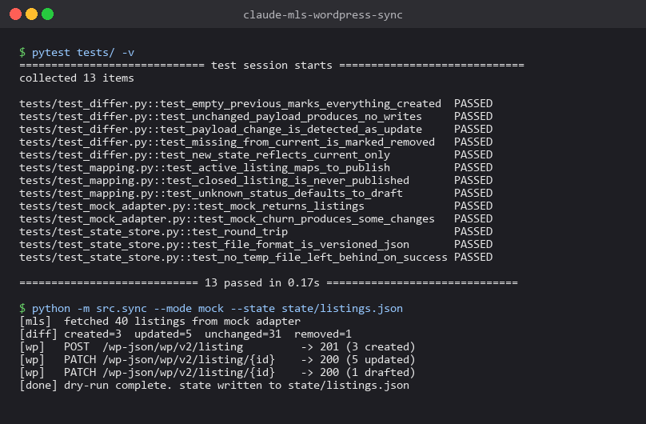
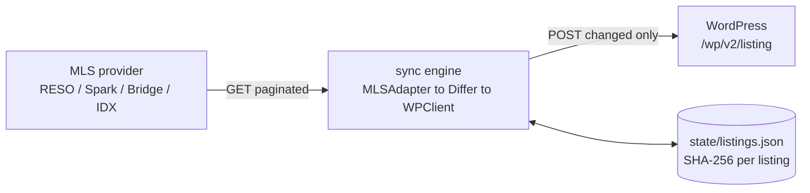

# claude-mls-wordpress-sync

[](https://github.com/sarteta/claude-mls-wordpress-sync/actions/workflows/tests.yml)
[](https://github.com/sarteta/claude-mls-wordpress-sync/actions/workflows/docker.yml)
[](https://www.python.org)
[](./LICENSE)

Diff-based sync engine: MLS listings (RESO / Bridge / Spark / mock adapter) into WordPress Custom Post Types via the REST API. Python async, YAML-driven field mapping, atomic state store, dead-letter log.





## How the diff sync works

1. Pull listings from the MLS, paginated, filtered by `ModificationTimestamp` when supported.
2. Load the local snapshot (`state/listings.json`) that maps `listing_id` to a content hash.
3. Compute the delta: created, updated, unchanged, removed.
4. POST only the changes to WordPress via REST.
5. Removed listings get drafted, never hard-deleted, so the broker can review.
6. Save the new state atomically.

A 1,200-listing feed running every 15 minutes typically updates fewer than 20 posts per cycle.

## What is in the repo

- **MLS adapters** in `src/mls_adapters/` (`reso.py`, `bridge.py`, `mock.py`). Switching providers is a config change.
- **YAML field mapping** in `config/field_mapping.yaml`. Map MLS field names to WP fields without touching code.
- **Idempotent**. Two runs without MLS changes produce zero WP writes.
- **Resilience**. 3 retries with exponential backoff; permanent failures go to `logs/dead-letter.jsonl`.
- **Async** via `httpx.AsyncClient` with bounded concurrency.
- **Health endpoint**. `python -m src.health` reports last sync time, success rate, dead-letter count. Pipe to Slack or Uptime Kuma.

## Quickstart

```bash
git clone https://github.com/sarteta/claude-mls-wordpress-sync.git
cd claude-mls-wordpress-sync
python -m venv .venv && source .venv/bin/activate   # Windows: .venv\Scripts\activate
pip install -r requirements.txt
cp .env.example .env                                  # fill in creds
python -m src.sync --provider mock --dry-run          # preview the diff
python -m src.sync --provider mock                    # apply changes
```

`--provider mock` uses the bundled fake feed so you can see the diff engine without touching a real MLS.

## Configuration

```env
MLS_PROVIDER=reso              # reso | bridge | spark | mock
MLS_BASE_URL=https://api.example-mls.com
MLS_ACCESS_TOKEN=<redacted>
MLS_PAGE_SIZE=200

WP_BASE_URL=https://your-wp-site.com
WP_USER=integration-bot
WP_APP_PASSWORD=<redacted>
WP_POST_TYPE=listing

SYNC_INTERVAL_MINUTES=15
STATE_PATH=./state/listings.json
LOG_LEVEL=INFO
```

```yaml
# config/field_mapping.yaml
post_fields:
  title: ListingKey
  content: PublicRemarks
  status: derived_from_MlsStatus  # Active -> publish, Closed -> draft
meta_fields:
  price: ListPrice
  bedrooms: BedroomsTotal
  bathrooms: BathroomsTotalInteger
  sqft: LivingArea
  address: UnparsedAddress
  listing_agent_name: ListAgentFullName
  listing_agent_phone: ListAgentPreferredPhone
```

## Running on a schedule

```cron
*/15 * * * * cd /srv/claude-mls-sync && /srv/claude-mls-sync/.venv/bin/python -m src.sync >> logs/cron.log 2>&1
```

Windows Task Scheduler: use the included `scripts/run-sync.ps1`.

Docker: `docker compose up -d` runs the sync loop internally every `SYNC_INTERVAL_MINUTES`.

## Roadmap

- [x] Core diff engine
- [x] Mock adapter (fake feed for testing)
- [x] RESO Web API adapter
- [x] WP REST client (via app passwords)
- [x] YAML field mapping
- [x] Exponential retries and dead-letter logging
- [ ] Spark API adapter
- [ ] Bridge Interactive adapter
- [ ] Image diffing + lazy downloads

## License

MIT
